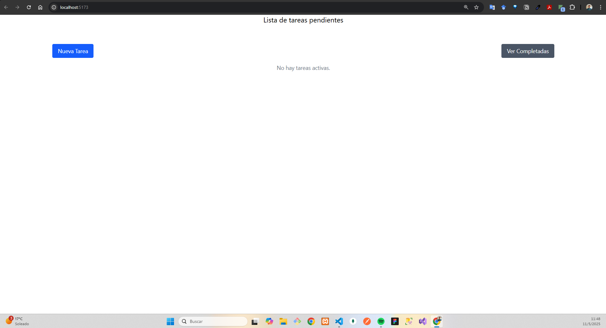
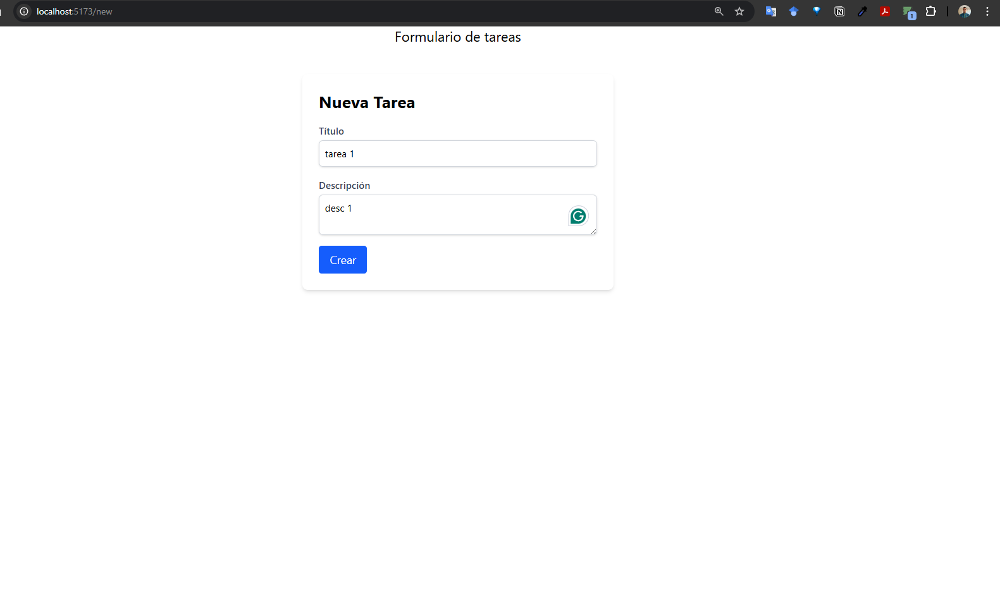
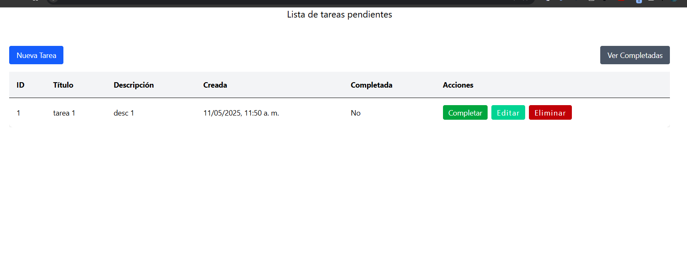
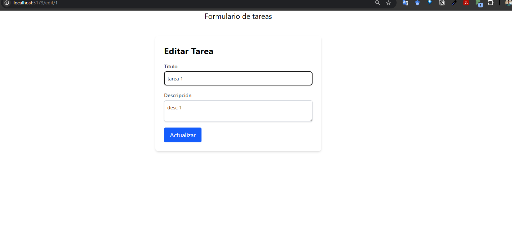
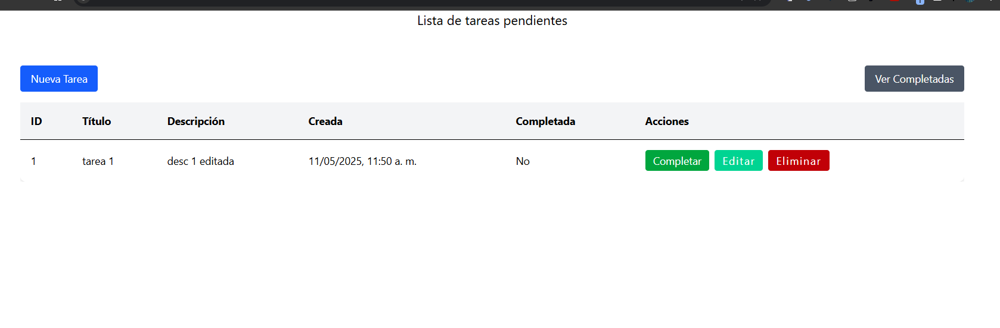
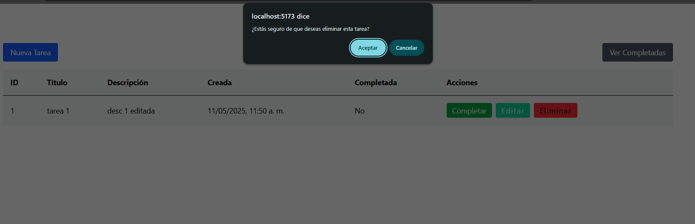
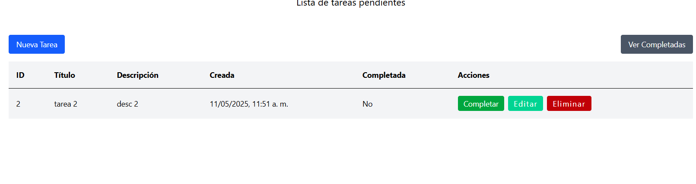
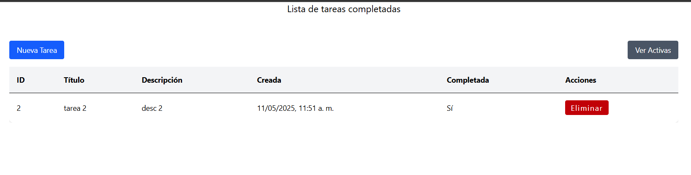

# Lista de Tareas - Challenge ForIT 2025

Una aplicación de gestión de tareas desarrollada como parte del challenge de ingreso a Academia ForIT 2025. Permite crear, editar, completar y eliminar tareas, además de visualizar las tareas activas y completadas.

## 🚀 Características

- ✨ Crear nuevas tareas con título y descripción
- 📝 Editar tareas existentes
- ✅ Marcar tareas como completadas
- 🗑️ Eliminar tareas
- 📋 Ver lista de tareas activas y completadas
- 💾 Persistencia de datos en el servidor

## 🛠️ Tecnologías utilizadas

- **Frontend**: React + Vite
- **Backend**: Node.js + Express
- **Estilos**: Tailwind CSS
- **Base de datos**: Almacenamiento en memoria

## 📋 Requisitos previos

- Node.js (versión 14 o superior)
- npm (incluido con Node.js)

## 🔧 Instalación y ejecución

1. Clonar el repositorio:
```bash
git clone https://github.com/moonsftw/challenge-lista-tareas.git
cd challenge-lista-tareas
```

2. Instalar dependencias del backend:
```bash
cd backend
npm install
```

3. Iniciar el servidor backend:
```bash
npm start
```

4. En otra terminal, instalar dependencias del frontend:
```bash
cd ../frontend
npm install
```

5. Iniciar el servidor de desarrollo frontend:
```bash
npm run dev
```

6. Abrir la aplicación en el navegador:
   - Frontend: http://localhost:5173
   - Backend: http://localhost:3000

## 🌟 Capturas de pantalla

### Lista de Tareas

*Vista principal de la aplicación mostrando la lista de tareas*

### Crear Tarea

*Formulario para crear una nueva tarea*

### Tarea Creada

*Vista de la tarea recién creada en la lista*

### Edición de Tarea

*Interfaz de edición de una tarea existente*

### Tarea Editada

*Vista de la tarea después de ser editada*

### Eliminar Tarea

*Confirmación para eliminar una tarea*

### Lista Actualizada

*Lista de tareas después de eliminar una tarea*

### Tareas Completadas

*Vista de las tareas marcadas como completadas*

## ⚙️ Variables de entorno

El proyecto requiere las siguientes variables de entorno:

### Backend (.env)
```env
PORT=3000
```

### Frontend (.env)
```env
VITE_API_URL=http://localhost:3000
```

## 📁 Estructura del proyecto

```
challenge-lista-tareas/
├── backend/
│   ├── index.js
│   └── package.json
├── frontend/
│   ├── src/
│   │   ├── components/
│   │   │   ├── TaskForm.jsx
│   │   │   ├── TaskItem.jsx
│   │   │   └── TaskList.jsx
│   │   └── App.jsx
│   └── package.json
└── README.md
```

## 👤 Autor

Facundo - Challenge de ingreso Academia ForIT 2025

## 📄 Licencia

Este proyecto está bajo la Licencia MIT - ver el archivo [LICENSE.md](LICENSE.md) para más detalles.

## 🔗 Enlaces

- [Repositorio](https://github.com/moonsftw/challenge-lista-tareas)